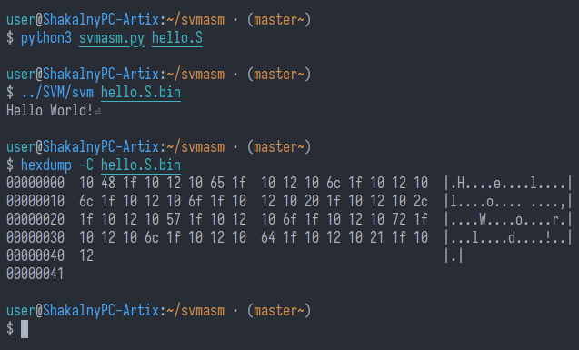

# svmasm.py - Ассемблер для [SVM](https://github.com/DisStudio-SOFT/SVM) на Python

Особо от варианта мнемоник из "документации" SVM не отличается, но есть некоторые различия:
 * Там, где `sclear` -> `sclr`

Так же существует поддержка SVM из Soulang, там опкод `sjz` был заменён на `prvs`
Так-как `prvs` и `sjz` принимают те-же аргументы, для svmasm `sjz` = `prvs` 

# Как использовать:

`python3 svmasm.py <имя файла>`

А затем вы можете скормить полученный `<имя файла>.bin` SVM

Не обладает поддержкой комментариев, меток, директив или прочих подобных вещей, так как на данный момент SVM не поддерживает, например, прыжки в разные участки программы

# Пример программы:

```as
spush '!'
scall putchar
sclr
spush 0
scall exit
```
выведет '!' и выйдет с кодом выхода 0

Так-же, есть файл [hello.S](hello.S), который выводит "Hello, World!":
